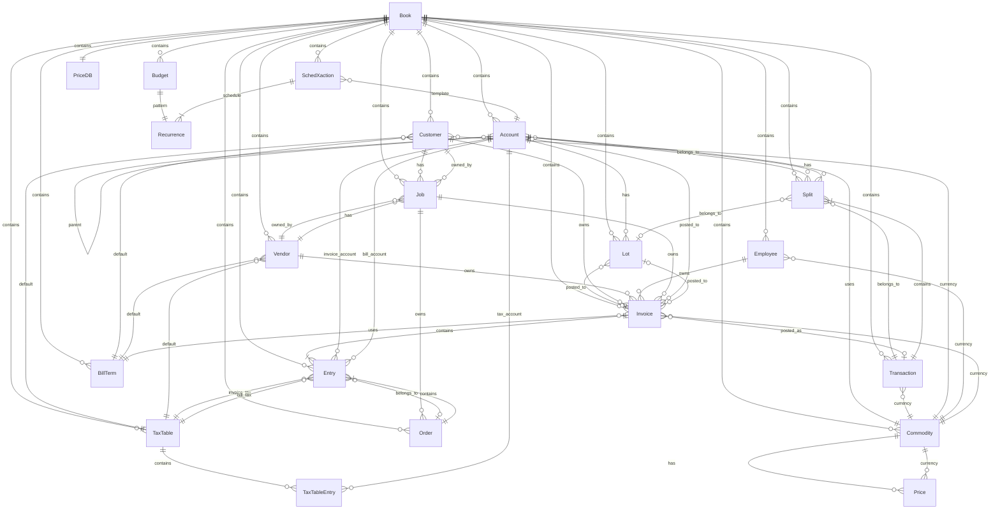

# AI-Native Accounting Platform Specification

**Source System:** GnuCash (legacy desktop application)
**Target Vision:** Modern multi-tenant cloud accounting SaaS
**Extraction Date:** 2026-09-19
**HITL Checkpoint #1:** 2026-09-19 (approved)
**Initial Market:** FVA Accounting — Singapore SMEs

---

## 1. Executive Summary

This specification extracts the accounting semantics, invariants, and workflows from GnuCash's mature codebase to define the foundation for a reimagined cloud-native accounting platform. The legacy system provides the **behavioral specification** — what the accounting engine must do — while the target architecture will provide a completely new product and runtime model.

**Key Principles:**
- Preserve GnuCash's rigorous double-entry accounting model
- Simplify how users interact with the ledger (task-oriented workflows)
- Maintain audit-grade data integrity and transaction atomicity
- Support multi-tenant, multi-entity, multi-currency operations
- Enable document intelligence and AI-assisted analytics

---

## 2. Capabilities

### 2.1 Core Accounting Capabilities

The system **must** support:

#### Double-Entry Bookkeeping
- Every transaction consists of splits that balance to exactly zero
- Multi-currency transactions: imbalance computed per-commodity (not aggregated)
- Trading accounts: non-trading splits balance independently from trading splits
- Transaction edit atomicity via begin/commit/rollback protocol

#### Account Management
- Hierarchical chart of accounts with parent-child relationships
- Account types: ASSET, LIABILITY, INCOME, EXPENSE, EQUITY (fundamental types)
- Specialized types: BANK, CASH, CREDIT, STOCK, MUTUAL, RECEIVABLE, PAYABLE, etc.
- Root account cannot have parent; excluded from account type validation
- AP/AR accounts detected separately from general asset/liability types

#### Transaction Lifecycle
- Transaction states: draft → posted → reconciled → frozen → void
- Reconciliation flags per-split: 'n' (not reconciled), 'c' (cleared), 'y' (reconciled), 'f' (frozen), 'v' (void)
- Reconciled balance includes only 'y' (reconciled) splits
- Read-only transactions cannot be destroyed (except during book shutdown)
- Empty transactions auto-destroyed when last split removed
- Transaction destruction cascades to capital gains transactions
- Journal logging on transaction lifecycle events (BeginEdit, Destroy)

#### Multi-Currency Support
- Each account has a commodity (currency or security)
- Transactions have a currency; splits have amount (in account commodity) and value (in transaction currency)
- Price database stores historical exchange rates
- Price lookup: nearest-in-time (can be before or after), nearest-before
- Balance conversion uses nearest price at specified time
- Multi-commodity invoice posting requires price existence or fails

#### Lot Tracking and Capital Gains
- Lots group splits for inventory/stock tracking
- Lot closure: balance equals exactly zero (emergent, not explicit action)
- Lot assignment policies: FIFO, LIFO, average, manual
- FIFO: assign to earliest open lot with matching balance sign
- Lot constraints: currency homogeneity, temporal ordering (new splits must be >= opening split date)
- Capital gains tracking via lazy "dirty" flag
- Gains splits are read-only (only memo is user-editable)
- Gains transaction date syncs with source transaction date

#### Reconciliation
- Account reconciliation compares splits against external statement
- Reconciled balance = sum of splits with flag 'y' (reconciled)
- Cleared balance = sum of splits with flag 'c' (cleared)
- Projected minimum balance = worst intra-day balance through today

### 2.2 Business Accounting Capabilities

#### Invoice and Bill Management
- Invoice types: customer invoice, vendor bill, employee voucher, credit notes
- Invoice posting is one-way: creates Lot + Transaction, marks invoice as posted
- Posted invoices cannot be re-posted (returns NULL)
- Invoice amounts always stored positive; sign determined by owner type (customer vs vendor)
- Credit notes treated identically to invoices (amounts already stored negative)
- Multi-commodity invoice posting requires price; amount = value / price (ROUND_HALF_UP)
- Bill terms stabilized on posting (immutable child created if necessary)
- Bill entry from invoice freezes invoice price
- Credit card employee expenses split to separate account

#### Customer, Vendor, Employee Management
- Business entities with addresses, default currency, billing terms, tax tables
- Jobs/projects link invoices and orders to customers/vendors
- Orders contain entries; can be invoiced later
- Owner polymorphism: Customer, Vendor, Employee, Job all implement Owner interface

#### Tax Calculation
- Tax tables contain entries: VALUE (absolute amount) or PERCENT (percentage of base)
- Tax-included price back-computation: `pretax = (aggregate - tvalue) / (1 + tpercent)`
- Discount ordering modes:
  - PRETAX: discount on pretax, tax on (pretax - discount)
  - SAMETIME: discount on pretax, tax on pretax (ignoring discount)
  - POSTTAX: discount on (pretax + tax), tax on pretax
- Tax table immutability via parent/child chain with reference counting
- Per-entry tax-included flag: YES, NO, USEGLOBAL
- Bill tax values cached lazily; recomputed on access when dirty
- All computed values rounded to commodity fraction (ROUND_HALF_UP)

#### Budgeting
- Budget structure: name, description, periods, recurrence pattern
- Per-account per-period budget values (optional) and notes
- Budget enforcement appears informational (no hard blocking in engine)
- GUI may provide warnings but engine does not reject over-budget transactions

#### Scheduled Transactions
- Scheduled transaction properties: name, enabled, start/end dates, occurrence counts, auto-create flags
- Auto-create: transactions generated automatically when due
- Auto-notify: user notified when transaction created
- Advance creation/reminder: create/notify N days before scheduled date
- Template account contains template transactions with formulas
- Instance creation: clone template transactions, apply formulas, handle exchange rates
- Batch creation suspends QOF events to avoid per-transaction GUI updates
- Termination: either occurrence count OR end date (not both)
- Execution skips read-only books and when no instances pending

### 2.3 Data Import/Export Capabilities

#### Import Formats
- **QIF (Quicken Interchange Format):** Text-based legacy format
- **OFX (Open Financial Exchange):** XML-based banking standard
- **CSV (Comma-Separated Values):** Configurable column mapping for transactions, accounts, prices
- **Customer/Business Import:** CSV with customer/vendor data
- **Log Replay:** Transaction log file replay
- **Online Banking (AqBanking):** HBCI, OFX, PayPal protocols

#### Export Formats
- **CSV Export:** Transactions and accounts with configurable columns
- **PDF Export:** Reports via print-to-PDF
- **HTML Export:** Reports as standalone HTML with embedded CSS
- **Print:** Reports to printer or PDF via GTK print system

#### Database Backends
- **XML Backend:** Native GnuCash format (compressed XML)
- **SQL Backend:** SQLite, PostgreSQL, MySQL via libdbi
- **Backend abstraction:** QofBackend interface for storage plugins

### 2.4 Reporting Capabilities

#### Built-in Reports
- Balance Sheet, Income Statement, Cash Flow, Net Worth
- Transaction Report, Account Summary
- Budget Report, Tax Schedule
- Invoice/Bill reports
- Custom reports via Scheme scripting

#### Report Output
- HTML (primary format via WebKit2 rendering)
- PDF (via print-to-PDF)
- PostScript (via GTK print system)
- Chart.js visualizations for charts

### 2.5 User Interface Capabilities

#### Main Application Windows
- Primary window with account tree, transaction register, report viewer
- Dialogs and wizards for: account creation, transaction entry, import/export, invoice/bill management, reconciliation, scheduled transactions, commodity selection, financial calculator, transaction search

#### Register Interface
- Spreadsheet-like transaction entry interface
- Split editing with inline amount/value/memo fields
- Reconciliation flag display and editing
- Multi-currency amount display

---

## 3. Domain Model

### 3.1 Core Entities



### 3.2 Entity Definitions

#### Book (QofBook)
- **Purpose:** Top-level container for dataset; provides access to all entity collections and storage backend
- **Key Attributes:** guid, is_open, is_readonly, backend, collections
- **Relationships:** Contains all entities; has one Backend, PriceDB, Commodity table, Root Account

#### Account
- **Purpose:** Ledger account where splits are recorded; forms hierarchical tree
- **Key Attributes:** guid, name, code, description, type (GNCAccountType), commodity, parent, book
- **Relationships:** Has many Splits and Lots; belongs to Book; has one Commodity; parent-child hierarchy
- **Invariants:** Name cannot contain account separator; must have valid commodity; value = sum of splits + sub-account values

#### Transaction
- **Purpose:** Embodies double-entry accounting; consists of date, description, and balanced splits
- **Key Attributes:** guid, date, date_entered, description, num, currency, txn_type, book
- **Relationships:** Has many Splits; belongs to Book; has one Currency
- **Invariants:** Split values sum to zero (when double-entry enforced); all splits valued in transaction currency

#### Split
- **Purpose:** Fundamental accounting unit; debit/credit entry with amount, value, memo, reconciliation status
- **Key Attributes:** guid, amount, value, memo, action, reconcile_flag, date_reconciled, online_id, account, transaction, lot, book
- **Relationships:** Belongs to Account and Transaction; optionally belongs to Lot
- **Invariants:** Must belong to exactly one account and transaction; amount/value must be valid gnc_numeric

#### Lot (GNCLot)
- **Purpose:** Groups splits for inventory/stock tracking; closed when balance reaches zero
- **Key Attributes:** guid, title, notes, is_closed, account, invoice, book
- **Relationships:** Has many Splits (same account); belongs to Account; optionally linked to Invoice
- **Invariants:** All splits in same account; balance = sum of split amounts; closed when balance = 0

#### Commodity (gnc_commodity)
- **Purpose:** Anything tradable (currencies, stocks, bonds)
- **Key Attributes:** guid, namespace, mnemonic, fullname, cusip, fraction, quote_flag, quote_source, book
- **Relationships:** Used by many Accounts and Transactions; has many Prices
- **Invariants:** Must have valid namespace; fraction <= 10^9

#### Price (GNCPrice)
- **Purpose:** Instantaneous quote for commodity w.r.t. another commodity at specific time
- **Key Attributes:** commodity, currency, value, time, source, type
- **Relationships:** Prices one Commodity in one Currency; stored in PriceDB
- **Invariants:** Must have valid commodity/currency; value must be valid gnc_numeric

#### Customer, Vendor, Employee
- **Purpose:** Business entities for invoicing, billing, expense tracking
- **Key Attributes:** guid, id, name, notes, address, currency, terms, taxtable, active, book
- **Relationships:** Have many Jobs and Invoices; have default BillTerm and TaxTable; have one Currency
- **Invariants:** Must have valid name and address

#### Invoice (GncInvoice)
- **Purpose:** Invoice, bill, voucher, or credit note with entries and posting status
- **Key Attributes:** guid, id, type, owner, date_opened, date_posted, terms, currency, posted_acc, posted_txn, posted_lot, entries, book
- **Relationships:** Has many Entries; owned by Customer/Vendor/Employee/Job; posted to Account as Transaction in Lot
- **Invariants:** Type must match owner type; when posted, must have posted_acc/txn/lot; BillTerm immutable after posting

#### Entry (GncEntry)
- **Purpose:** Line item in invoice/bill with description, quantity, price, tax
- **Key Attributes:** guid, date, description, quantity, inv_account, inv_price, inv_taxtable, bill_account, bill_price, bill_taxtable, order, invoice, book
- **Relationships:** Belongs to Invoice or Order; has invoice/bill accounts and tax tables
- **Invariants:** Must belong to invoice or order; credit notes store quantity sign-reversed

#### Job, Order
- **Purpose:** Project/task for customer/vendor; order contains entries for later invoicing
- **Key Attributes:** guid, id, name, owner, entries, book
- **Relationships:** Owned by Customer/Vendor; have many Invoices/Orders/Entries

#### Budget (GncBudget)
- **Purpose:** Budget with period-based account values
- **Key Attributes:** guid, name, description, num_periods, recurrence, book
- **Relationships:** Has one Recurrence; belongs to Book
- **Invariants:** Values in account commodity; inclusive of sub-accounts; max 999 periods

#### TaxTable (GncTaxTable)
- **Purpose:** Tax rates for invoices; becomes immutable when added to invoice
- **Key Attributes:** guid, name, entries, modtime, refcount, parent, child, invisible, book
- **Relationships:** Has many TaxTableEntries; optionally has parent/child TaxTable
- **Invariants:** Becomes immutable when added to invoice; reference counting tracks usage

#### BillTerm (GncBillTerm)
- **Purpose:** Billing terms (due date, early payment discount)
- **Key Attributes:** guid, name, description, type (DAYS/PROXIMO), duedays, discdays, discount, cutoff, refcount, parent, child, book
- **Relationships:** Optionally has parent/child BillTerm
- **Invariants:** Becomes immutable when added to invoice; DAYS: due = posted + duedays; PROXIMO: due calculated from cutoff

#### ScheduledTransaction (SchedXaction)
- **Purpose:** Recurring transaction template with occurrence rules
- **Key Attributes:** guid, name, schedule (recurrences), start_date, end_date, last_date, num_occurances, enabled, autoCreateOption, template_acct, book
- **Relationships:** Has many Recurrences; has one Template Account
- **Invariants:** If end_date invalid, no end; if num_occurances_total = 0, no limit

#### Recurrence
- **Purpose:** Periodic date patterns (e.g., "every Friday", "1st of every 3rd month")
- **Key Attributes:** start, ptype (ONCE/DAY/WEEK/MONTH/END_OF_MONTH/NTH_WEEKDAY/LAST_WEEKDAY/YEAR), mult, wadj
- **Relationships:** Used by Budget and ScheduledTransaction
- **Invariants:** Invalid period defaults to MONTH; invalid mult defaults to 1

---

## 4. Interface Contracts

### 4.1 File Import/Export Interfaces

#### QIF Import
```yaml
direction: inbound
trigger: user-initiated (File→Import→QIF)
payload:
  format: text
  structure: Quicken Interchange Format
  sections:
    - Type: Account, Transaction, etc.
    - Fields: D (date), N (number), T (amount), P (payee), M (memo), L (category)
```

#### OFX Import
```yaml
direction: inbound
trigger: user-initiated (File→Import→OFX)
payload:
  format: XML
  structure: Open Financial Exchange
  sections:
    - SIGNONMSGSRSV1: Authentication
    - BANKMSGSRSV1: Bank statements
    - INVSTMTMSGSRSV1: Investment statements
  versions: OFX 1.x, OFX 2.x
```

#### CSV Import/Export
```yaml
direction: bidirectional
trigger: user-initiated
payload:
  format: CSV
  structure: Configurable column mapping
  variants:
    - transactions: Date, Number, Description, Memo, Account, Amount, Currency
    - accounts: Account hierarchy structure
    - prices: Commodity price data
```

#### XML Backend
```yaml
direction: bidirectional
trigger: application startup, save
payload:
  format: XML (compressed)
  structure: GnuCash native format
  root: <gnc-v2>
  sections:
    - accounts
    - transactions
    - commodities
    - prices
    - budgets
    - schedxactions
```

#### SQL Backend
```yaml
direction: bidirectional
trigger: application startup, save
payload:
  format: SQL
  databases: [SQLite, PostgreSQL, MySQL]
  tables:
    - accounts: Account hierarchy
    - transactions: Financial transactions
    - splits: Transaction splits
    - commodities: Currency/security definitions
    - prices: Price history
    - budgets: Budget data
    - schedxactions: Scheduled transactions
    - invoices, bills, customers, vendors, employees: Business entities
```

### 4.2 Network Interfaces

#### Online Banking (AqBanking)
```yaml
direction: bidirectional
protocols: [HBCI, OFX, PayPal]
operations:
  - transfer: Outbound bank transfer
  - get_transactions: Download transaction list
  - get_balance: Get account balance
credentials:
  storage: AqBanking secure storage (not in GnuCash files)
  fields: [bank_code, account_number, PIN]
```

#### Price Fetching
```yaml
direction: outbound
mechanism: Finance::Quote Perl module (external dependency, invoked via subprocess)
sources: [Yahoo Finance, Alpha Vantage, etc.]
payload:
  input: commodity symbol
  output: {symbol, date, price, currency}
storage: PriceDB (prices table)
```

### 4.3 API Interfaces

#### Python Bindings
```yaml
direction: bidirectional
protocol: SWIG-generated Python API
modules:
  - gnucash_core: Core bindings (Session, Book, Account, Transaction, Split)
  - gnucash_business: Business entities (Customer, Vendor, Invoice, etc.)
capabilities:
  - Read/write accounts, transactions, splits
  - Manage customers, vendors, employees
  - Create/edit invoices and bills
  - Query price database
  - Execute reports
```

#### REST API (Example Implementation)
```yaml
direction: bidirectional
protocol: HTTP/JSON
endpoints:
  /api/accounts:
    GET: List all accounts
  /api/account/<guid>:
    GET: Get account details
  /api/transactions:
    GET: List transactions
  /api/transaction/<guid>:
    GET/PUT/DELETE: Transaction CRUD
  /api/customers:
    GET/POST: Customer management
  /api/vendors:
    GET/POST: Vendor management
  /api/invoices:
    GET/POST: Invoice management
  /api/bills:
    GET/POST: Bill management
  /api/entries:
    GET/POST/PUT/DELETE: Invoice/bill entries
```

### 4.4 Report Generation Interfaces

```yaml
direction: outbound
formats: [HTML, PDF, PostScript]
reports:
  - Balance Sheet
  - Income Statement
  - Cash Flow
  - Net Worth
  - Transaction Report
  - Account Summary
  - Budget Report
  - Tax Schedule
  - Invoice/Bill reports
payload:
  definition:
    - report_id, name, type
    - date_range, accounts_filter
    - options (columns, sorting, grouping)
    - style_sheet_reference
  output:
    - HTML with embedded CSS
    - Chart.js visualizations
    - Tables, charts, summaries
```

---

## 5. Non-Functional Requirements

### 5.1 Performance
- **Auto-save interval:** Configurable, default 10 minutes
- **Scheduled transaction processing:** Daily check (on application startup)
- **Price updates:** On-demand (user-initiated)
- **Report generation:** Sub-second for standard reports on typical datasets (<100K transactions)

### 5.2 Data Integrity
- **Transaction atomicity:** Begin/commit/rollback protocol ensures consistency
- **Double-entry enforcement:** Transaction balance must be exactly zero (no tolerance)
- **Referential integrity:** All entity relationships maintained (splits → accounts, splits → transactions)
- **Immutability:** Posted invoices and tax tables become immutable via reference counting

### 5.3 Scalability
- **Dataset size:** Tested with datasets containing 100K+ transactions
- **Account hierarchy:** Supports arbitrary depth (typical: 3-5 levels)
- **Multi-currency:** Unlimited commodities; price database stores historical rates

### 5.4 Concurrency
- **Single-user:** Legacy application is single-user desktop (no concurrent access)
- **Edit locking:** BeginEdit/CommitEdit protocol prevents concurrent modification within session
- **File locking:** Backend-dependent (XML: file locks; SQL: database locks)

### 5.5 Auditability
- **Journal logging:** Transaction lifecycle events logged (BeginEdit, Destroy)
- **Reconciliation tracking:** Per-split reconciliation flags with dates
- **Online ID tracking:** Imported transactions retain source identifier (OFX/HBCI ID)
- **Modification tracking:** Date entered vs. transaction date captures edit timing

---

## 6. Behavior Contract

The following Given/When/Then rules define the **P0 critical invariants** that must be preserved in the reimagined system. These rules are non-negotiable accounting fundamentals.

### 6.1 Transaction Balance Invariants

**BR-ACCT-001: Transaction balance invariant (double-entry)**
- **Given:** A Transaction with one or more Splits
- **When:** the transaction is evaluated for balance
- **Then:** the sum of all Split values must be exactly zero; if trading accounts are in use, the non-trading splits must sum to zero AND the trading splits must sum to zero independently

**BR-ACCT-002: Multi-currency transaction balance per commodity**
- **Given:** A Transaction using trading accounts with splits in multiple commodities
- **When:** imbalance is computed
- **Then:** imbalance is computed per-commodity (not aggregated); the transaction is balanced only if there is zero imbalance in every commodity used

**BR-ACCT-003: Transaction edit atomicity**
- **Given:** A Transaction being modified
- **When:** BeginEdit is called before the edit
- **Then:** a clone of the transaction is preserved; if CommitEdit is called the changes persist; if RollbackEdit is called the transaction is restored to the clone

### 6.2 Account Type Invariants

**BR-ACCT-006: Account fundamental types**
- **Given:** A GNCAccountType value
- **When:** fundamental type is determined
- **Then:** BANK/STOCK/MONEYMRKT/CHECKING/SAVINGS/MUTUAL/CURRENCY/CASH/ASSET/RECEIVABLE → ASSET; CREDIT/LIABILITY/PAYABLE/CREDITLINE → LIABILITY; INCOME → INCOME; EXPENSE → EXPENSE; EQUITY → EQUITY

**BR-ACCT-007: AP/AR type detection**
- **Given:** A GNCAccountType value
- **When:** AP/AR type check is performed
- **Then:** returns TRUE only for RECEIVABLE or PAYABLE; all other types return FALSE

**BR-ACCT-010: Root account cannot have parent**
- **Given:** An account of type ROOT
- **When:** parent account compatibility is checked
- **Then:** returns FALSE — root accounts cannot have parent accounts

### 6.3 Reconciliation Invariants

**BR-SPLIT-001: Split reconciliation states**
- **Given:** A Split in a Transaction
- **When:** the reconciled flag is examined
- **Then:** valid values are: 'n' (not reconciled), 'c' (cleared), 'y' (reconciled), 'f' (frozen), 'v' (void)

**BR-SPLIT-004: Reconciled balance only includes reconciled splits**
- **Given:** An Account with splits in various states
- **When:** reconciled balance is computed
- **Then:** only splits with reconciled state 'y' contribute to the balance; cleared ('c') and not-reconciled ('n') splits are excluded

### 6.4 Invoice and Posting Invariants

**BR-BUS-001: Invoice posting is one-way**
- **Given:** An Invoice that is not yet posted
- **When:** posting is initiated
- **Then:** a new Lot is created; a new Transaction is created; the invoice is marked posted; attempting to post an already-posted invoice returns NULL

**BR-BUS-002: Invoice amounts are always stored positive**
- **Given:** An Invoice or Bill or Credit Note with entries
- **When:** entry values are converted to posting splits
- **Then:** amounts in entries are always stored as positive values; the sign for the split is determined by the owner type (customer vs vendor/employee)

### 6.5 Tax Calculation Invariants

**BR-TAX-001: Tax table entry types**
- **Given:** A Tax Table with one or more entries
- **When:** each entry is examined
- **Then:** each entry has a type of either VALUE (absolute monetary amount) or PERCENT (percentage of base); values are summed; percents are summed

**BR-TAX-002: Tax-included price back-computation**
- **Given:** An Entry with tax_included = TRUE and aggregate = qty × price
- **When:** the pre-tax value is computed
- **Then:** pretax = (aggregate - tvalue) / (1 + tpercent); net_price = pretax / qty

**BR-TAX-003: Discount ordering modes**
- **Given:** An Entry with a discount and a tax
- **When:** discount_how is applied
- **Then:**
  - PRETAX: discount on pretax, tax on (pretax - discount)
  - SAMETIME: discount on pretax, tax on pretax
  - POSTTAX: discount on (pretax + tax), tax on pretax

### 6.6 Foreign Exchange Invariants

**BR-FX-001: Price lookup nearest-in-time**
- **Given:** A PriceDB and a (commodity, currency, time) tuple
- **When:** nearest-in-time lookup is called
- **Then:** returns the price closest to time t (can be before or after)

### 6.7 Lot and Capital Gains Invariants

**BR-LOT-001: Lot closure criterion**
- **Given:** A Lot with one or more splits
- **When:** lot balance is computed
- **Then:** the lot is marked closed if and only if the sum of adjusted split amounts equals exactly zero

**BR-LOT-002: Lot balance cached closure flag**
- **Given:** A Lot whose closure status is unknown
- **When:** closure status is requested
- **Then:** if status is unknown, balance is computed first to determine and cache the closure status

---

## 7. Open Questions for SME Confirmation

The following questions arose during extraction and require Subject Matter Expert (SME) confirmation:

1. **BR-LOT-006:** When a middle lot's amount changes, is there a deterministic re-computation order? Are user-built lots truly exempt from re-computation?

2. **BR-CAP-002:** What other values can the gains field take beyond UNKNOWN and GAINS?

3. **BR-BUD-003:** Is budget enforcement purely informational, or does the GUI layer ever block over-budget transactions?

4. **BR-ACCT-013:** Are there additional journal log codes beyond 'B' (BeginEdit) and 'D' (Destroy)?

---

## 8. Summary Statistics

**Business Rules Extracted:** 36 total
- **By Category:** 24 accounting, 7 tax, 5 business
- **By Priority:** 12 P0 (critical), 20 P1 (important), 4 P2 (nice-to-have)
- **By Confidence:** 32 High, 4 Medium, 0 Low

**Domain Entities:** 21 total
- **Core accounting:** 6 (Account, Transaction, Split, Lot, Commodity, Price)
- **Business:** 8 (Customer, Vendor, Employee, Invoice, Entry, Job, Order, Address)
- **Supporting:** 5 (Budget, TaxTable, BillTerm, ScheduledTransaction, Recurrence)
- **Storage:** 2 (Book, Session)

**External Interfaces:** 75+ total
- **GUI entry points:** 25+ dialogs, wizards, windows
- **File I/O:** 10 formats (QIF, OFX, CSV, XML, SQL, PDF, HTML, etc.)
- **Network:** 3 protocols (HBCI/OFX online banking, HTTP REST, price fetching)
- **Database:** 3 backends (XML, SQLite, PostgreSQL, MySQL)
- **APIs:** 2 binding systems (Python, Guile)
- **Reports:** 10+ built-in report types
- **Scheduled:** Auto-save, scheduled transactions

---

## 9. HITL Checkpoint #1 — Prioritization Decisions

**Decision Date:** 2026-09-19
**Decision:** Treat GnuCash as behavioral specification, not structural template. Preserve accounting semantics, replace implementation.

### 9.1 Core Accounting Invariants (P0 — Preserve)

The following accounting invariants are non-negotiable:
- Double-entry accounting with exact-zero balance on posted journals
- Multi-currency amount/value semantics with historical exchange rates
- Atomic posting and editing (database transactions, not literal BeginEdit/CommitEdit)
- Hierarchical chart of accounts with fundamental types (ASSET, LIABILITY, INCOME, EXPENSE, EQUITY)
- AR/AP distinction from general asset/liability accounts
- Transaction lifecycle: draft → validated posting → immutable balanced journal
- Reconciliation state transitions (n → c → y → f → v) — preserve semantics, not character representation
- Deterministic rounding to commodity precision (ROUND_HALF_UP)
- Posted-document integrity — posted accounting data not silently mutated
- Referential integrity between journals, lines, accounts, and source documents
- Historical tax treatment preservation
- Correction workflows (credit notes, reversals, voids) — all auditable

**Key Clarification:** Draft business documents may be temporarily incomplete/unbalanced. Exact-zero requirement applies only when journal is posted.

### 9.2 P0 Capabilities for Initial SaaS Launch

**Core Accounting:**
- Ledger and journals
- Chart of accounts (hierarchical)
- Multi-currency/FX with price history
- Customers, vendors (unified as Party/Counterparty with roles)
- Sales invoices, supplier bills, credit notes (unified as AccountingDocument with direction)
- Payments and receipts
- Accounts receivable and payable
- Payment terms (versioned, historical preservation)
- Tax/GST calculation (versioned tax rules, historical preservation)
- Bank transaction import (modern formats/providers, not AqBanking)
- Bank reconciliation
- Journal entries
- Attachments/source documents
- Approval workflows
- Standard financial reporting
- Audit trail (immutable event history)
- Fiscal periods and period locking

**SaaS Platform:**
- Tenant / Workspace (distinct from Legal Entity)
- Legal Entity (owns independent ledger)
- Workspace membership and invitations
- Entity-scoped RBAC (workspace admin, entity admin, accountant, bookkeeper, AP/AR clerk, approver, auditor, read-only)
- Authentication
- Immutable audit/event history
- PostgreSQL multi-tenant isolation (evaluate RLS vs schema-per-tenant)
- Background jobs (Celery or equivalent)
- Object storage (S3-compatible for documents/attachments)
- REST/GraphQL APIs
- Notifications
- WebSockets where needed

**Multi-Entity Accounting:**
- Connected legal entities within tenant
- Intercompany relationships
- Linked cross-entity accounting events
- Pending counterpart postings with accept/modify/reject workflow
- Entity-specific journal entries (no journal spans multiple entities)
- Intercompany balance matching and mismatch detection
- Approval workflows for intercompany events
- `InterEntityEvent` coordination object above entity journals
- Consolidation/eliminations (P1, but architecture must support)

**Document Intelligence:**
- Receipt and invoice upload (drag-drop, email, API)
- Object storage for documents
- OCR and structured extraction (supplier, customer, dates, amounts, line items, tax)
- Supplier/customer recognition and historical matching
- Duplicate detection (invoice numbers, amounts, dates)
- Bank transaction matching against documents
- Source document → accounting document linkage
- Learned accounting mappings (explicit organizational knowledge, not LLM memory)
- Confidence scoring for AI suggestions
- Human review and correction workflow
- Audit trail of AI/OCR decisions

**AI-Assisted Bookkeeping:**
- Suggested account/category based on historical mappings
- Suggested tax treatment
- Suggested party (customer/vendor)
- Suggested dimension/project/cost centre
- Document matching
- Confidence scoring
- Anomaly surfacing (unusual amounts, duplicate invoices, unexpected tax treatment)
- AI produces proposals; deterministic engine performs validation and posting

**Migration:**
- GnuCash XML import (migration source, not production persistence)
- GnuCash SQL database import (SQLite/PostgreSQL/MySQL — migration sources)
- CSV import/export (transactions, chart of accounts, customers/vendors)
- Full data portability (complete accounting-data export)

**Singapore Localization (Initial Market):**
- GST (Goods and Services Tax) handling
- InvoiceNow/e-invoicing integration (architect for, implement as localization layer)
- SME bookkeeping workflows
- Accountant/client collaboration
- Practice-level exception handling

### 9.3 P1 Capabilities (Post-Launch)

- Budgets (informational, not hard constraints)
- Scheduled/recurring transactions (RecurringRule + generated instances)
- Projects/dimensions/cost centres/departments
- Employee expense claims/vouchers
- Consolidation and eliminations (group accounting)
- Advanced AI analytics (variance analysis, trend detection, natural-language explanations)
- OFX file import
- QIF migration/import
- Advanced report customization
- Orders/procurement (purchase orders, sales orders)
- Investment accounting (securities, lots, FIFO/LIFO/average, capital gains, price history)

### 9.4 P2 Capabilities (Deferred)

- Advanced lot/capital-gains workflows
- Legacy specialist import protocols (HBCI, PayPal via AqBanking)
- Highly specialized GnuCash compatibility features

### 9.5 Explicitly Dropped/Replaced

**Do Not Preserve:**
- GTK desktop UI
- Session entity (desktop persistence concept)
- XML/SQLite/MySQL runtime persistence (PostgreSQL only)
- AqBanking dependency (replace with modern bank integrations)
- HBCI-specific implementation
- SWIG Python public bindings (replace with REST/GraphQL)
- Guile/Scheme runtime dependency (use Scheme reports as behavior specs only)
- PostScript output
- WebKit-based HTML report rendering
- Legacy REST endpoint structure (design new domain-oriented API)
- Literal one-character state representations (use proper state machines)
- Implementation-specific reference-counting/versioning mechanisms (use database versioning)

**Replace With:**
- Bank connectivity → Modern provider abstractions (Plaid, Yodlee, direct bank APIs)
- Python/Guile bindings → REST/GraphQL APIs, webhooks, event interfaces
- Desktop GUI → React/TypeScript web interface
- File-based persistence → PostgreSQL with multi-tenant isolation
- Scheme reports → Modern reporting/query layer
- AqBanking → Direct integrations with banks and payment providers

### 9.6 Domain Entity Restructuring

**Keep as First-Class Concepts:**
- Account (hierarchical chart of accounts)
- JournalEntry / Transaction (posted accounting entries)
- JournalLine / Split (individual debits/credits)
- Currency / Commodity (currencies and securities)
- ExchangeRate / Price (historical rates)
- Tax (versioned tax rules)
- PaymentTerm (versioned payment terms)
- Budget (informational, not blocking)
- RecurringTransaction (scheduled templates)
- Ledger / Book → EntityLedger (belongs to LegalEntity)

**Restructure:**
- Customer + Vendor + Employee → **Party / Counterparty** with roles
  - A party may have multiple roles (customer, supplier, employee, connected entity)
  - Avoid GnuCash owner-polymorphism implementation
- Invoice / Bill / Credit Note → **AccountingDocument / CommercialDocument**
  - Direction (sales vs purchase)
  - Document type (invoice, bill, credit note)
  - Counterparty (Party)
  - Document lines
  - Posting status
  - Accounting references
  - Expose as product concepts even if sharing underlying model
- Entry → **DocumentLine**
- Job → **Project / Dimension**
  - Eventually support: project, department, cost centre, location, business unit
- TaxTable → **TaxRule / TaxRate** (versioned)
  - Preserve invariant: posted documents retain historical tax rules
- BillTerm → **PaymentTerm** (versioned)
  - Preserve invariant: posted documents retain historical payment terms
- ScheduledTransaction + Recurrence → **RecurringRule** + generated instances
- Lot, investment-specific Commodity/Price behavior → Defer but preserve domain understanding

**Remove:**
- Session (desktop persistence concept)
- Book → evolve into EntityLedger or AccountingBook belonging to LegalEntity

### 9.7 AI Analytics Architecture (P0 Architecture, P1 Capability)

**Pattern:** Deterministic accounting query → metrics/variance/anomaly analysis → evidence → LLM explanation

**Principles:**
- Ledger remains source of truth
- AI explains and interrogates accounting data, does not invent it
- Every AI conclusion traceable to accounts, transactions, documents, deterministic calculations
- Do not pass entire ledger to LLM for calculation

**Capabilities (P1):**
- Variance analysis (budget vs actual, period comparison)
- Trend detection (supplier price increases, customer payment behavior)
- Anomaly detection (unusual transactions, unexpected currency changes)
- Working-capital analysis
- Cash-flow forecasting
- Reconciliation assistance
- Intercompany mismatch investigation
- Financial ratio analysis
- Natural-language report generation

**Example Queries:**
- "Why did operating expenses increase this month?"
- "What caused cash flow to fall?"
- "Which suppliers have increased prices?"
- "Which customers are paying later than usual?"
- "What is driving gross-margin deterioration?"

### 9.8 Multi-Tenancy and Isolation Strategy

**Evaluate approaches:**
- Shared tables with tenant IDs + PostgreSQL Row-Level Security (RLS)
- Schema-per-tenant
- Hybrid approaches

**Assessment criteria:**
- Tenant isolation guarantees (financial data requires strong isolation)
- Operational complexity
- Scalability
- Reporting and analytics (cross-tenant queries for platform analytics)
- Backups and migrations
- Cross-entity operations (intercompany within tenant)
- Future cross-tenant connections (business network)

**Decision:** Defer to architecture phase. Do not decide solely on convenience.

### 9.9 Accounting Correctness in Distributed System

**Must address:**
- Transaction atomicity (database transactions with proper isolation levels)
- Idempotency (retrying payment request must not create duplicate transaction)
- Duplicate request prevention (idempotency keys)
- Optimistic or pessimistic concurrency (version numbers or row locks)
- Posting locks (prevent concurrent posting of same document)
- Fiscal-period locks (prevent posting to closed periods)
- Journal immutability rules (posted journals cannot be modified, only corrected via reversal)
- Correction/reversal semantics (credit notes, void, replacement)
- Background-job retries (idempotent job processing)
- Cross-entity event consistency (intercompany event coordination)
- Eventual consistency where acceptable (notifications, analytics)
- Strong consistency where accounting integrity requires it (posting, reconciliation)

---

## 10. Next Steps

Proceed to **Phase C: Architecture Design** with these prioritization decisions as constraints.
