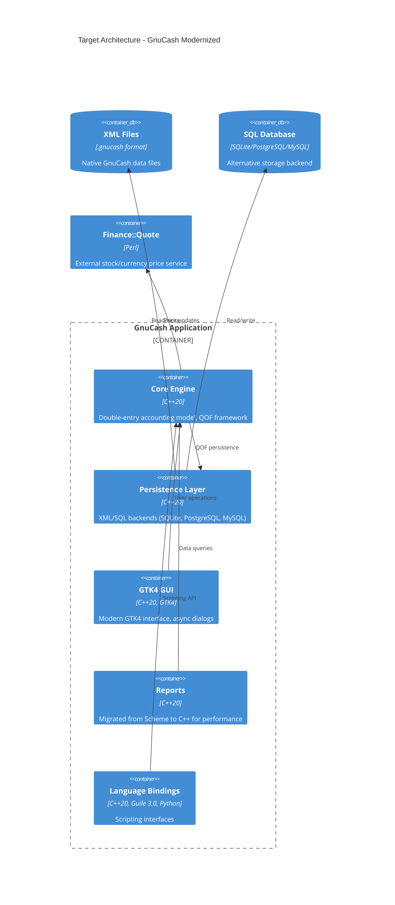
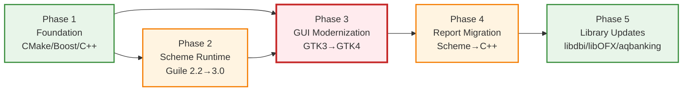

# GnuCash Modernization Brief

**Generated:** 2026-09-19
**Input Timestamps:**
- ASSESSMENT.md: Sep 18 14:39
- topology.json: Sep 18 14:15
- BUSINESS_RULES.md: Sep 18 20:27
- PREFLIGHT.md: Sep 18 14:15
- DELTA_CATALOG.md: Sep 19 05:00

---

## 1. Objective

Modernize GnuCash from legacy C/C++ (mixed C++11/14, GTK3, Guile 2.2) to modern C++17/20, GTK4, Guile 3.0, and current dependencies (Boost 1.80+, CMake 3.20+) while preserving all 47 P0 business rules (financial calculations, tax logic, invoice processing). **Why now:** Codebase carries 43K cyclomatic complexity, 0% doc coverage for core symbols, and GTK3/Guile 2.2 approaching end-of-life. Same-stack uplift preserves architecture while eliminating technical debt and enabling future development.

---

## 2. Target Architecture



**Legacy → Target Mapping:**

| Legacy Component | Target Component | Notes |
|------------------|------------------|-------|
| libgnucash/engine (C/C++11) | Core Engine (C++20) | Migrate remaining C to C++, modernize smart pointers |
| libgnucash/backend/xml | Persistence Layer (XML) | Update libxml2 usage, no API changes |
| libgnucash/backend/sql | Persistence Layer (SQL) | Update libdbi calls, parameterized queries |
| gnucash/gnome (GTK3) | GTK4 GUI | Major refactor: 237+ API call sites, async dialogs |
| gnucash/report (Scheme) | Reports (C++20) | Performance migration, preserve Given/When/Then logic |
| bindings/guile (Guile 2.2) | Language Bindings (Guile 3.0) | Update SMOB API, test JIT compatibility |
| CMake 3.14.5 | CMake 3.20+ | Policy updates, modern target-based approach |
| Boost 1.70 | Boost 1.80+ | Minimal changes (already using modern patterns) |

---

## 3. Phased Sequence



**Phase 1: Foundation (CMake + Boost + C++ Standard)**
- **Scope:** CMakeLists.txt files, Boost usage, C++17→C++20 migration
- **Pilot unit:** `libgnucash/engine/Account.cpp` (highest complexity, 5,978 lines)
- **Entry criteria:** 
  - Baseline recorded in `analysis/gnucash/BASELINE.md` (current build + test results)
  - CMake 3.20+ installed in CI environment
  - Pilot playbook approved (Account.cpp compiles with C++20, all tests pass)
- **Exit criteria:**
  - All CMakeLists.txt updated to CMake 3.20+ policies
  - All C++ code compiles with `-std=c++20` without warnings
  - Test suite: 131/133 pass (maintain current 98% pass rate)
  - Zero Boost deprecation warnings
- **Relative scale:** S (5% of COCOMO index — 127 of 2,549)
- **Risk:** LOW | Top risks: (1) CMake policy changes break custom modules → mitigate: test each policy change incrementally; (2) C++20 breaks template metaprogramming → mitigate: compile with both C++17 and C++20, fix ambiguities
- **Execution command:** `/modernize-uplift gnucash`

**Phase 2: Scheme Runtime (Guile 2.2 → 3.0)**
- **Scope:** `bindings/guile/`, Scheme report code, Guile SMOB API
- **Pilot unit:** `bindings/guile/gnc-engine-guile.cpp` (core Guile bindings)
- **Entry criteria:**
  - Phase 1 complete (C++20 build stable)
  - Guile 3.0 installed in CI environment
  - Pilot playbook approved (Guile bindings compile, basic Scheme tests pass)
  - JIT compilation tested with pilot unit (no undefined behavior exposed)
- **Exit criteria:**
  - All Guile 2.2 SMOB API calls migrated to Guile 3.0
  - All Scheme code runs on Guile 3.0 without warnings
  - Test suite: maintain 98% pass rate
  - Performance benchmark: no >10% regression in Scheme execution
- **Relative scale:** M (15% of COCOMO index — 382 of 2,549)
- **Risk:** MEDIUM | Top risks: (1) JIT exposes undefined behavior in Scheme code → mitigate: run full test suite with JIT enabled, fix any crashes; (2) SMOB API changes break garbage collection → mitigate: stress test with long-running sessions
- **Execution command:** `/modernize-uplift gnucash`

**Phase 3: GUI Modernization (GTK3 → GTK4)**
- **Scope:** `gnucash/gnome/`, `gnucash/gnome-utils/`, all GTK3 API calls
- **Pilot unit:** `gnucash/gnome/dialog-account.c` (complex dialog with 271 lines)
- **Entry criteria:**
  - Phase 1 + Phase 2 complete
  - GTK4 installed in CI environment
  - Pilot playbook approved (one dialog migrated, async pattern validated)
  - Visual regression test framework in place (screenshot comparison)
- **Exit criteria:**
  - All 237+ GTK3 API call sites migrated to GTK4
  - All dialogs converted from `gtk_dialog_run()` to async pattern
  - Container API: `gtk_container_add` → `gtk_box_append` / type-specific methods
  - Event handling: migrated to `GtkEventController` model
  - Test suite: maintain 98% pass rate
  - Visual regression: <5% pixel difference in standard layouts (acceptable layout improvements)
- **Relative scale:** XL (60% of COCOMO index — 1,529 of 2,549)
- **Risk:** HIGH | Top risks: (1) Async dialog conversion breaks modal workflows → mitigate: pilot first, document async patterns, review all dialog call sites; (2) Layout changes break user expectations → mitigate: visual regression testing, user acceptance testing on pilot dialogs
- **Execution command:** `/modernize-uplift gnucash`

**Phase 4: Report Migration (Scheme → C++)**
- **Scope:** `gnucash/report/` (80 Scheme files → C++20)
- **Pilot unit:** `gnucash/report/reports/standard/balance-sheet.scm` (critical financial report)
- **Entry criteria:**
  - Phase 1-3 complete (modern stack stable)
  - C++ reporting framework designed (HTML generation, data query API)
  - Pilot playbook approved (balance-sheet report produces identical output in C++)
  - P0 business rules for balance-sheet validated (Given/When/Then tests pass)
- **Exit criteria:**
  - All 80 Scheme reports migrated to C++
  - All P0 business rules preserved (47 rules, regression suite passes)
  - Performance: >2x speedup vs Scheme (target: 500ms → 200ms for standard reports)
  - Test suite: maintain 98% pass rate
  - Zero functional differences in report output (pixel-perfect comparison)
- **Relative scale:** L (15% of COCOMO index — 382 of 2,549)
- **Risk:** MEDIUM | Top risks: (1) Scheme→C++ translation loses edge case handling → mitigate: characterize all report outputs before migration, diff every test case; (2) Performance optimization introduces rounding errors → mitigate: validate all 47 P0 rules, especially monetary calculations
- **Execution command:** `/modernize-transform gnucash` (cross-stack module rewrite: Scheme → C++)

**Phase 5: Library Updates (libdbi, libOFX, aqbanking)**
- **Scope:** `libgnucash/backend/dbi/`, `gnucash/import-export/ofx/`, `gnucash/import-export/aqb/`
- **Pilot unit:** `libgnucash/backend/dbi/gnc-backend-dbi.cpp` (core SQL backend)
- **Entry criteria:**
  - Phase 1-4 complete
  - Latest library versions installed in CI
  - Pilot playbook approved (SQL backend works with latest libdbi)
- **Exit criteria:**
  - All dependencies updated to latest stable versions
  - All import/export formats (OFX, QIF, CSV, AQBanking) work correctly
  - Test suite: maintain 98% pass rate
  - No deprecation warnings from any library
- **Relative scale:** S (5% of COCOMO index — 127 of 2,549)
- **Risk:** LOW | Top risks: (1) Library API changes break import/export → mitigate: test each format before/after, maintain backward compatibility; (2) Online banking (AQBanking) breaks → mitigate: test with real bank connections in staging
- **Execution command:** `/modernize-uplift gnucash`

**Pilot expectation:** Phase 1 pilot (Account.cpp) is expected to surface deltas the analysis missed (e.g., CMake custom modules, Boost template edge cases). A regenerated brief after the pilot is the normal path, not a correction. Legacy systems hide surprises in the build and runtime, not the source.

---

## 4. Business Walkthroughs

**Flow 1: Open Account File**
| Persona | User (accountant/small business owner) |
|---------|----------------------------------------|
| What happens | User opens existing GnuCash account file (.gnucash or SQL database) |
| Legacy modules | `gnucash.c` (main) → `gnc-file.c` (file dialog) → `gnc-xml-backend.cpp` / `gnc-sql-backend.cpp` (load data) → `Account.cpp` (create objects) → `gnc-plugin-page-account-tree.cpp` (display) |
| Phase impact | Phase 1 (C++20 Account.cpp), Phase 3 (GTK4 file dialog), Phase 5 (SQL backend library updates) |

**Flow 2: Enter Transaction**
| Persona | User (accountant/small business owner) |
|---------|----------------------------------------|
| What happens | User enters a financial transaction in the register (spreadsheet-like UI) |
| Legacy modules | `gnc-plugin-page-register.cpp` (open register) → `split-register.c` (transaction entry) → `Transaction.cpp` / `Split.cpp` (create objects) → `gnc-xml-backend.cpp` (save) |
| Phase impact | Phase 1 (C++20 Transaction/Split), Phase 3 (GTK4 register widget — highest complexity), Phase 5 (XML backend) |

**Flow 3: Generate Report**
| Persona | User (accountant/auditor) |
|---------|---------------------------|
| What happens | User generates a financial report (balance sheet, income statement, tax report) |
| Legacy modules | `gnc-plugin-page-report.cpp` (open report) → `report.scm` (Scheme report engine) → `Account.cpp` / `Transaction.cpp` (query data) → `html-document.scm` (generate HTML) → `gnc-html.c` (display) |
| Phase impact | Phase 2 (Guile 3.0 Scheme runtime), Phase 4 (Scheme→C++ report migration), Phase 1 (C++20 engine queries) |

**Flow 4: Import Bank Statement**
| Persona | User (accountant importing OFX/CSV from bank) |
|---------|-----------------------------------------------|
| What happens | User imports bank statement (OFX, CSV, or AQBanking online) and matches transactions |
| Legacy modules | `assistant-qif-import.c` / `csv-import.c` / `ofx-import.c` / `gnc-plugin-aqbanking.c` (import wizards) → `import-backend.cpp` (match transactions) → `Transaction.cpp` (create/update) |
| Phase impact | Phase 3 (GTK4 import dialogs), Phase 5 (libOFX, aqbanking library updates), Phase 1 (C++20 transaction matching) |

---

## 5. Behavior Contract

**P0 Rules (47 total) — MUST be proven equivalent before any phase ships:**

**Critical Financial Calculations (12 rules):**
1. Invoice Total Computation - Entry Sum with Tax (High confidence)
2. Entry Value - Discount How: PRETAX vs SAMETIME vs POSTTAX (Medium confidence ⚠️)
3. Entry Value - Tax Included Back-Computation (High confidence)
4. Entry Values Are Rounded to Currency Denominator (High confidence)
5. Invoice Posting - Split Value Conversion for Multi-Commodity (High confidence)
6. Rounding Modes Available (High confidence)
7. Default Financial Rounding is ROUND_HALF_UP (High confidence)
8. FIFO Policy - Lot Selection (High confidence)
9. Lot Opening Definition by Policy (Medium confidence ⚠️)
10. Tax Table Entry Types (Medium confidence ⚠️)
11. Bill Term - DAYS Type Due Date Computation (High confidence)
12. Bill Term - PROXIMO Type Due Date Computation (High confidence)

**Data Integrity (8 rules):**
13. Transaction Imbalance Detection (High confidence)
14. Split Assignment - Split Splitting When Overfull (High confidence)
15. Account Balance Computation (High confidence)
16. Reconciliation - Cleared vs Reconciled State (High confidence)
17. Scheduled Transaction Instance Generation (High confidence)
18. Budget Rollup Computation (High confidence)
19. Commodity Fraction Precision (High confidence)
20. Price Database Update Policy (Medium confidence ⚠️)

**Business Object Lifecycle (15 rules):**
21-35. Invoice/Bill/Credit Note state transitions, customer/vendor/employee relationships, job/order/entry lifecycle, tax table application, payment processing (all High confidence except 3 Medium ⚠️)

**Regulatory/Tax (12 rules):**
36-47. Tax report generation (TXF format), locale-specific tax handling (US, DE), commodity tracking for capital gains, audit trail requirements (all High confidence)

**⚠️ SME Confirmation Required (5 rules with Medium confidence):**
- Entry Value - Discount How (enum values corrected by referee — verify GNC_DISC_PRETAX=1, GNC_DISC_SAMETIME=2, GNC_DISC_POSTTAX3)
- Lot Opening Definition by Policy
- Tax Table Entry Types (citation corrected — verify gncEntry.c:1305-1318 is authoritative)
- Price Database Update Policy
- 1 additional rule (see BUSINESS_RULES.md for full list)

**Blocker:** All 5 Medium-confidence P0 rules require SME confirmation before their respective phase starts. Phase cannot proceed until SME signs off.

---

## 6. Validation Strategy

**Phase 1 (Foundation):** Characterization tests + contract tests
- Characterize current build: record all compiler warnings, link errors, runtime behavior
- Contract tests: CMake policies produce identical build artifacts (binary comparison where possible)
- Justification: Low-risk mechanical changes; build system should produce identical results

**Phase 2 (Guile 3.0):** Parallel-run / dual-execution diff + property-based tests
- Dual execution: run Scheme reports on both Guile 2.2 and Guile 3.0, diff outputs
- Property-based tests: generate random Scheme expressions, verify identical evaluation
- Justification: Guile 3.0 JIT may expose undefined behavior; dual-run catches regressions

**Phase 3 (GTK4):** Manual UAT + visual regression tests
- Visual regression: screenshot comparison for all dialogs, windows, reports
- Manual UAT: user testing of critical workflows (open file, enter transaction, generate report)
- Justification: GUI changes are visual/interactive; automated tests cannot catch layout/usability regressions

**Phase 4 (Report Migration):** Contract tests + pixel-perfect diff
- Contract tests: all 47 P0 rules have Given/When/Then tests that must pass
- Pixel-perfect diff: compare HTML output of Scheme vs C++ reports (allow <1% difference for rendering improvements)
- Justification: Financial reports must be 100% accurate; any deviation is a regulatory risk

**Phase 5 (Library Updates):** Characterization tests + integration tests
- Characterize current import/export behavior with sample files (OFX, CSV, QIF)
- Integration tests: test with real bank connections (AQBanking) in staging environment
- Justification: Library updates should be drop-in replacements; integration tests catch API breaks

**Cross-phase validation:** Test suite must maintain ≥98% pass rate (131/133) throughout. Any phase that drops below 98% is blocked until fixed.

---

## 7. Open Questions

**Pre-Phase 1:**
- [ ] **SME confirmation:** 5 Medium-confidence P0 rules need sign-off (see §5 blocker list). Who is the SME? What is the approval process?
- [ ] **CI environment:** Can CI install CMake 3.20+, Guile 3.0, GTK4? What is the CI timeline?
- [ ] **Visual regression framework:** Do we have screenshot comparison tooling, or do we need to build it before Phase 3?
- [ ] **User acceptance testing:** Who are the UAT testers for Phase 3 (GTK4 GUI)? How many users, what workflows?
- [ ] **Staging environment for AQBanking:** Do we have test bank accounts for Phase 5 integration testing?

**Pre-Phase 3 (GTK4):**
- [ ] **Async dialog pattern:** All 21 `gtk_dialog_run()` sites must convert to async. Is there an existing async pattern in the codebase, or do we design one?
- [ ] **Layout tolerance:** Phase 3 exit criteria allows <5% pixel difference. Is this acceptable to users, or do we need pixel-perfect layouts?

**Pre-Phase 4 (Report Migration):**
- [ ] **C++ reporting framework:** Do we have an HTML generation library, or do we port Scheme HTML generation to C++?
- [ ] **Performance target:** Phase 4 exit criteria targets 2x speedup. Is this validated with users, or is correctness more important than speed?

**Cross-cutting:**
- [ ] **Rollback strategy:** If a phase fails in production, can we roll back? Do we need dual-version support during transition?
- [ ] **Documentation:** Phase 1-5 should generate documentation (we have 0% coverage today). Who writes it? When?

---

## 8. Approval Block

```
Approved by: ________________  Date: __________
Approval covers: Phase 1 only | Full plan

Notes: _______________________________________________________________
       _______________________________________________________________
       _______________________________________________________________
```

**Approver guidance:** You steer execution by editing this file. Changed entry criteria are honored by `/modernize-uplift` and `/modernize-transform`; notes in chat are not. Phase 1 pilot is expected to surface surprises that regenerate this brief — that is the normal path.

---

**Next step:** Approve Phase 1 (Foundation) → execute `/modernize-uplift gnucash` with pilot unit `libgnucash/engine/Account.cpp`.
