# Reimagined Architecture — FVA Accounting Platform

**Version:** 2.1 (Final Corrections Applied — Phase E Approved)
**Date:** 2026-09-19
**Status:** ✅ Approved — proceeding to Phase E scaffolding
**Spike Reports:**
- Spike 1 (Multi-Tenancy): `/projects/gnucash/analysis/gnucash/SPIKE_1_MULTI_TENANCY.md`
- Spike 2 (Multi-Currency): `/projects/gnucash/analysis/gnucash/SPIKE_2_MULTI_CURRENCY.md`
- Spike 3 (Semantic Verification): `/projects/gnucash/analysis/gnucash/SPIKE_3_SEMANTIC_VERIFICATION.md`

---

## 1. Architecture Overview

### 1.1 Design Principles

1. **Modular monolith first** — Start with strong bounded contexts in a single Django application; extract services only when scaling demands it
2. **Accounting engine is the core** — Deterministic, ACID-compliant, audit-grade; everything else orbits it
3. **API-first** — UI, integrations, and AI all consume the same application services via controlled APIs
4. **Event-driven where appropriate** — Use events for cross-bounded-context communication, background processing, and audit trail
5. **Multi-tenant from day one** — Tenant isolation via shared-schema PostgreSQL with Row Level Security (RLS); defense-in-depth with ORM filters + database-enforced policies
6. **Async by default** — Document processing, AI suggestions, notifications, bank sync all run asynchronously
7. **Immutable audit trail** — Every financially significant event is append-only and traceable
8. **Simplicity over flexibility** — Avoid over-engineering for v1; launch quickly, iterate based on customer feedback
9. **Learn before scaling** — Design for scale but add infrastructure only when actual load demonstrates the need

### 1.2 High-Level Architecture (C4 Container Diagram)

```mermaid
C4Context
    title FVA Accounting Platform - System Context (v2.1)

    Person(accountant, "Accountant / Bookkeeper", "Uses the platform to manage client books")
    Person(advisor, "Accounting Advisor", "Manages multiple client tenants via Practice")
    Person(business_owner, "Business Owner", "Views financial reports, approves transactions")
    Person(admin, "Platform Administrator", "Manages tenants, monitoring, support")

    System_Boundary(fva, "FVA Accounting Platform") {
        Container(web_app, "Web Application", "React, TypeScript", "SPA for accountants, advisors, and business owners")
        Container(api, "REST API", "Django REST Framework", "RESTful APIs for all platform operations")
        Container(accounting_engine, "Accounting Engine", "Django", "Core ledger, journals, posting logic, multi-currency, banking/reconciliation, minimal intercompany")
        Container(business_docs, "Business Documents", "Django", "Invoices, bills, parties, workflows")
        Container(doc_intel, "Document Intelligence", "Django + Celery + OCR", "Receipt/invoice OCR, extraction, matching, with full audit trail")
        Container(reporting, "Reporting & Analytics", "Django + Celery", "Financial reports, AI analytics, dashboards")
        ContainerDb(postgres, "PostgreSQL + RLS", "Multi-tenant database", "All accounting and business data; row-level security enforced at database layer")
        ContainerDb(redis, "Redis", "Cache + message broker", "Caching, Celery broker, rate limiting")
        Container(storage, "Object Storage", "S3-compatible", "Documents, attachments, OCR results")
        Container(celery_workers, "Celery Workers", "Python", "Async task processing with priority queues")
    }

    System_Ext(bank, "Bank / Payment Provider", "Provides bank feeds and payment APIs")
    System_Ext(invoice_now, "InvoiceNow / e-Invoicing", "Singapore e-invoicing network")
    System_Ext(ocr_service, "OCR Service", "AWS Textract / Google Document AI")
    System_Ext(llm_provider, "LLM Provider", "OpenAI / Anthropic / etc.")

    Rel(accountant, web_app, "Uses", "HTTPS")
    Rel(advisor, web_app, "Uses", "HTTPS")
    Rel(business_owner, web_app, "Uses", "HTTPS")
    Rel(admin, web_app, "Administers", "HTTPS")

    Rel(web_app, api, "API calls", "HTTPS/JSON")
    Rel(api, accounting_engine, "Reads/writes")
    Rel(api, business_docs, "Reads/writes")
    Rel(api, doc_intel, "Uploads documents")
    Rel(api, reporting, "Generates reports")

    Rel(accounting_engine, postgres, "Reads/writes")
    Rel(business_docs, postgres, "Reads/writes")
    Rel(doc_intel, postgres, "Reads/writes")
    Rel(reporting, postgres, "Reads")

    Rel(accounting_engine, bank, "Syncs transactions", "HTTPS/API")
    Rel(accounting_engine, invoice_now, "Sends/receives invoices", "HTTPS/API")

    Rel(doc_intel, storage, "Stores documents")
    Rel(doc_intel, ocr_service, "OCR + extraction")
    Rel(doc_intel, llm_provider, "AI suggestions")
    Rel(reporting, llm_provider, "AI analytics")

    Rel(accounting_engine, celery_workers, "Queues tasks")
    Rel(business_docs, celery_workers, "Queues tasks")
    Rel(doc_intel, celery_workers, "Queues tasks")
    Rel(celery_workers, redis, "Broker")

    UpdateElementStyle(accountant, $bgColor="#e1f5ff")
    UpdateElementStyle(advisor, $bgColor="#e1f5ff")
    UpdateElementStyle(business_owner, $bgColor="#e1f5ff")
    UpdateElementStyle(admin, $bgColor="#fff4e1")
```



### 1.3 Bounded Contexts (v1 — 5 Contexts)

**1. Identity & Access** (Platform Foundation)
- Authentication, authorization, tenancy
- Practice and advisor access model (new in v1.2)
- Tenant / Legal Entity / Membership / Role management
- Notifications (cross-cutting infrastructure)

**2. Accounting Engine** (Core Bounded Context)
- Chart of accounts, journal entries, posting logic
- Multi-currency support with historical exchange rates
- Banking integration and reconciliation
- Minimal intercompany functionality (new in v1.2)
- Fiscal periods, tax rules, payment terms

**3. Business Documents**
- Parties (customers, vendors, employees)
- Accounting documents (invoices, bills, credit notes)
- Document workflows and approvals

**4. Document Intelligence**
- Document upload and OCR
- Structured extraction and matching
- Learned accounting mappings
- Full audit trail (enhanced in v1.2)

**5. Reporting & Analytics**
- Standard financial reports
- AI-assisted analytics
- Dashboards and KPIs

---

## 2. Identity & Access Bounded Context

### 2.1 Core Responsibilities

- Authentication (email/password, OAuth, SSO for enterprise)
- Multi-tenancy (shared-schema PostgreSQL with RLS; decision complete)
- Tenant / Workspace management
- Legal Entity management (within tenant)
- User memberships and invitations
- Role-based access control (RBAC) with entity-scoped permissions
- **Accounting Practice / Advisor access model** (new in v1.2)
- Session management
- API token management
- Notifications (cross-cutting infrastructure)

### 2.2 Key Entities

**Tenant & Legal Entity:**
- `Tenant` (workspace — represents an SME/customer organization)
- `LegalEntity` (owns independent ledger within tenant)
- `User` (platform user)
- `Membership` (user ↔ tenant relationship)
- `Role` (workspace-level and entity-level permissions)
- `Permission` (granular access control)
- `ApiToken` (for API integrations)

**Accounting Practice / Advisor Access (new in v1.2):**
- `Practice` (accounting firm / advisory practice managing multiple clients)
- `PracticeMembership` (user ↔ practice relationship with role)
- `ClientEngagement` (practice ↔ tenant relationship)
- `AdvisorAccessGrant` (explicit, revocable, auditable access from practice to client tenant)
- `PracticeRole` (practice-level roles: partner, manager, senior, staff)

### 2.3 Accounting Practice Access Model

**Design Principles:**
1. A Tenant represents an SME/customer organization — NOT an accounting practice
2. A Practice manages multiple client Tenants through explicit engagements
3. Practice access is explicit, revocable, and auditable
4. Practice users switch between client contexts explicitly
5. Practice access does NOT merge client data into a single tenant
6. Future: practice-level exception dashboard, billing, usage aggregation

**Key Behaviors:**
- Practice user authenticates → sees list of client engagements
- Practice user selects client → context switches to that tenant
- Practice user operates within client tenant with entity-scoped permissions
- All practice actions logged with practice_id and engagement_id
- Client can revoke practice access at any time
- Practice cannot access client data without explicit engagement

**Data Model:**
```python
class Practice(models.Model):
    """Accounting firm / advisory practice"""
    guid = models.UUIDField(primary_key=True)
    name = models.CharField(max_length=255)
    # ... other practice metadata

class PracticeMembership(models.Model):
    """User membership in a practice"""
    user = models.ForeignKey(User, on_delete=models.CASCADE)
    practice = models.ForeignKey(Practice, on_delete=models.CASCADE)
    role = models.CharField(max_length=50)  # partner, manager, senior, staff
    # ...

class ClientEngagement(models.Model):
    """Practice engagement with a client tenant"""
    practice = models.ForeignKey(Practice, on_delete=models.CASCADE)
    tenant = models.ForeignKey(Tenant, on_delete=models.CASCADE)
    status = models.CharField(max_length=20)  # active, suspended, terminated
    started_at = models.DateTimeField()
    ended_at = models.DateTimeField(null=True, blank=True)
    # ...

class AdvisorAccessGrant(models.Model):
    """Explicit access grant from practice to client tenant"""
    engagement = models.ForeignKey(ClientEngagement, on_delete=models.CASCADE)
    practice_user = models.ForeignKey(User, on_delete=models.CASCADE)
    tenant_role = models.ForeignKey(Role, on_delete=models.CASCADE)  # role within client tenant
    granted_at = models.DateTimeField()
    revoked_at = models.DateTimeField(null=True, blank=True)
    # ...
```

**Multi-Tenancy Spike Considerations:**
- RLS must support practice users accessing multiple tenants
- Practice context switching must be secure (no cross-tenant data leakage)
- Audit trail must capture both practice_id and tenant_id
- Backup/restore must handle practice-tenant relationships
- Future cross-tenant accounting connections must be architecturally possible

### 2.4 Notifications (Cross-Cutting Infrastructure)

**Responsibilities:**
- Email notifications (approvals, reminders, alerts)
- In-app notifications (polling for v1, WebSockets deferred to v2)
- Workflow state machines (document approvals, intercompany events)

**Key Entities:**
- `Notification` (email, in-app)
- `NotificationPreference` (user settings)
- `WorkflowState` (state machine for approvals, intercompany events)

**Technology:** Django ORM, Celery for async notifications, email service (SendGrid, AWS SES)

**v1 Simplification:** No Django Channels / WebSockets. Use polling (30s intervals) for in-app notifications. Add WebSockets in v2 if collaborative editing or real-time dashboards required.

---

## 3. Accounting Engine Bounded Context

### 3.1 Core Responsibilities

- Chart of accounts (hierarchical)
- Journal entries and journal lines (double-entry)
- Posting logic (draft → posted → immutable)
- Multi-currency support with historical exchange rates
- Banking integration and reconciliation (merged into Accounting Engine in v1.2)
- Minimal intercompany functionality (new in v1.2)
- Fiscal periods and period locking
- Tax calculation (versioned tax rules)
- Payment terms (versioned)
- Audit trail (immutable event log)

### 3.2 Key Entities

**Core Accounting:**
- `Account` (hierarchical, with type: ASSET, LIABILITY, INCOME, EXPENSE, EQUITY)
- `JournalEntry` (posted accounting entry, immutable)
- `JournalLine` (individual debit/credit, belongs to JournalEntry and Account)
- `Currency` (ISO 4217 currencies)
- `Commodity` (securities, cryptocurrencies — future)
- `ExchangeRate` (historical rates)
- `TaxRule` (versioned, with effective dates)
- `PaymentTerm` (versioned, with effective dates)
- `FiscalPeriod` (with status: open, closed, locked)
- `AuditEvent` (immutable log of all financial actions)

**Banking & Reconciliation (merged into Accounting Engine):**
- `BankAccount` (linked to Account)
- `BankStatement` (imported statement)
- `BankTransaction` (individual transaction from statement)
- `BankReconciliation` (matching bank transactions to ledger entries)
- `PaymentGateway` (integration with Stripe, PayPal, etc.)
- `Payment` (processed payment)

**Minimal Intercompany (new in v1.2):**
- `IntercompanyRelationship` (links two LegalEntities within tenant)
- `InterEntityEvent` (coordination object above entity journals)
- `CounterpartPosting` (pending posting in counterparty entity)

**Deferred to v2:**
- Consolidation groups
- Automatic eliminations
- Complex FX consolidation
- Group reporting adjustments
- Cross-tenant connected businesses

### 3.3 Multi-Currency Posting Semantics (Final)

**Decision:** Dual-field amount/value model with hidden trading accounts (Spike 2 complete).

1. **Entity functional/base currency** — LegalEntity has base_currency; all reporting converts to this
2. **Document currency** — Invoice/Bill has its own currency (e.g., USD invoice for SGD entity)
3. **JournalEntry transaction_currency** — Explicit field; the currency in which the journal balances
4. **JournalLine amount** — Quantity in the account's commodity (e.g., USD 10,000 in a USD bank account)
5. **JournalLine value** — Quantity in the transaction's balancing currency (e.g., SGD 13,400 equivalent)
6. **Account currency** — Each Account has a commodity (currency or security)
7. **Exchange rate storage** — ExchangeRate table with (from_currency, to_currency, date, rate); daily granularity, multiple sources
8. **Rate source and effective date** — Priority: explicit rate on transaction > rate on transaction date > most recent rate before > system default
9. **Realized FX** — At settlement: difference between original rate and settlement rate; automatic FX gain/loss journal entry
10. **Unrealized FX** — At period-end revaluation: difference between book value and revalued value; explicit unrealized FX adjustment entries
11. **Settlement** — System detects foreign-currency settlement, looks up original and settlement rates, creates FX entries automatically
12. **Revaluation** — Period-end process scans foreign-currency balances, converts at period-end rate, creates adjusting entries
13. **Rounding** — ROUND_HALF_UP to commodity fraction (SCU); rounding differences to FX gain/loss account
14. **Multi-currency balancing** — Per-commodity balancing via internal trading accounts; trading accounts hidden from users, marked as system accounts
15. **GnuCash migration** — Faithful preservation of trading-account books; trading accounts preserved internally but not exposed to users
16. **Securities/commodities** — Same dual-field model applies; future investment accounting uses same mechanics

**Worked Example (USD invoice, SGD entity):**
- Invoice: USD 10,000 at rate 1.34 → JournalLine amount=10000 USD, value=13400 SGD
- Settlement at rate 1.365 → System creates automatic FX loss entry: SGD 250
- User sees clean transaction without trading-account complexity

### 3.4 Minimal Intercompany Functionality (v1.2)

**v1 Scope:**
- IntercompanyRelationship (links two LegalEntities)
- InterEntityEvent (coordination object)
- Source entity creates journal entry
- Proposed counterpart posting created in counterparty entity
- Counterparty accepts / modifies / rejects
- Each entity's journal remains independently balanced
- Permanent linkage between counterpart journal entries
- Mismatch detection (amount, currency, classification, date differences)

**v1 Constraints:**
- No consolidation groups
- No automatic eliminations
- No complex FX consolidation
- No group reporting adjustments
- No cross-tenant connections

**Data Model:**
```python
class IntercompanyRelationship(models.Model):
    """Links two legal entities for intercompany transactions"""
    entity_a = models.ForeignKey(LegalEntity, on_delete=models.CASCADE, related_name='intercompany_relationships_a')
    entity_b = models.ForeignKey(LegalEntity, on_delete=models.CASCADE, related_name='intercompany_relationships_b')
    relationship_type = models.CharField(max_length=50)  # parent_subsidiary, sister_companies, etc.
    # ...

class InterEntityEvent(models.Model):
    """Coordination object above entity journals"""
    guid = models.UUIDField(primary_key=True)
    source_entity = models.ForeignKey(LegalEntity, on_delete=models.CASCADE, related_name='source_events')
    counterparty_entity = models.ForeignKey(LegalEntity, on_delete=models.CASCADE, related_name='counterparty_events')
    source_journal_entry = models.ForeignKey(JournalEntry, on_delete=models.CASCADE, related_name='source_events')
    counterpart_journal_entry = models.ForeignKey(JournalEntry, on_delete=models.CASCADE, null=True, blank=True, related_name='counterpart_events')
    status = models.CharField(max_length=20)  # proposed, accepted, modified, rejected
    mismatch_status = models.CharField(max_length=20)  # matched, amount_mismatch, currency_mismatch, etc.
    # ...

class CounterpartPosting(models.Model):
    """Proposed posting in counterparty entity"""
    inter_entity_event = models.ForeignKey(InterEntityEvent, on_delete=models.CASCADE)
    proposed_journal_entry = models.ForeignKey(JournalEntry, on_delete=models.CASCADE)
    accepted_by = models.ForeignKey(User, on_delete=models.SET_NULL, null=True, blank=True)
    accepted_at = models.DateTimeField(null=True, blank=True)
    # ...
```

**Future Architectural Hooks:**
- ConsolidationGroup entity (deferred)
- EliminationEntry entity (deferred)
- Saga pattern for cross-entity coordination (can be added later)
- Outbox pattern for reliable event publishing (can be added later)

### 3.5 Semantic Verification (Final)

**Reconciliation State Machine (Spike 3 complete):**
- ReconcileStatus enum: NOT_CLEARED (n), CLEARED (c), RECONCILED (y), FROZEN (f), VOID (v)
- Explicit ALLOWED_TRANSITIONS matrix enforced at model layer (not just UI)
- ReconciliationAuditLog for compliance-grade traceability (actor, timestamp, old/new status, reconciliation run)
- Void modeled as separate columns (voided_amount, voided_value, voided_at, voided_by) with CheckConstraint, not KVP
- Edit guard at application/service layer: locked splits (RECONCILED, FROZEN) require explicit unreconcile action before editing

**Tax Discount Ordering (Spike 3 complete):**
- discount_ordering_mode on InvoiceLine (per line item, mirroring GnuCash's GncEntry.i_disc_how)
- DiscountOrderingMode enum: PRETAX (1), SAMETIME (2), POSTTAX (3)
- frozen_tax_table_json snapshot at posting for historical reproducibility (GnuCash weakness: tax table referenced by pointer, can silently change)
- Rounding: ROUND_HALF_UP at per-line, per-tax-account level, after exact rational math

**Posted Journal Immutability (Spike 3 complete):**
- **Database-level enforcement via PostgreSQL BEFORE UPDATE / BEFORE DELETE triggers** (NOT CheckConstraint — CHECK constraints validate row values and cannot compare OLD vs NEW state)
- Triggers reject UPDATE/DELETE on posted financial records (is_posted=True) at the database layer
- Application/service-layer mutation guards as additional defense
- Separate models: ImmutablePostedTransaction/ImmutablePostedSplit (immutable financial facts) vs TransactionMetadata (mutable operational state)
- Immutable financial fields: account, amount, value, transaction/posting currency, financial transaction date, legal entity, posting relationships, tax/accounting snapshots
- Mutable operational fields: reconciliation state, bank matching, attachments, comments, review status, external references
- Formal reversal/correcting entry workflow for changing financial history

### 3.6 Accounting Correctness in Distributed System

**Approach:**
1. **Synchronous posting** — Journal entry posting is synchronous (not background job) to ensure ACID compliance
2. **Database transactions** — Use Django's `transaction.atomic()` with REPEATABLE READ isolation level
3. **Optimistic concurrency** — Add `version` field to mutable entities (draft documents); check on update
4. **Pessimistic locking** — Use `select_for_update()` when posting documents to prevent concurrent posting
5. **Idempotency keys** — All API writes accept `Idempotency-Key` header; store in PostgreSQL with unique constraint (not Redis)
6. **Fiscal period locks** — Check period status before posting; reject if closed/locked
7. **Immutable audit trail** — All financial actions logged to `AuditEvent` table (append-only, no updates/deletes)
8. **Background job retries** — Celery tasks are idempotent; use idempotency keys to prevent duplicates
9. **Intercompany coordination** — `InterEntityEvent` uses state machine with explicit transitions; counterpart postings are separate transactions

---

## 4. Business Documents Bounded Context

### 4.1 Core Responsibilities

- Parties (customers, vendors, employees — unified as Party with roles)
- Accounting documents (invoices, bills, credit notes — unified as AccountingDocument with direction)
- Document lines (line items)
- Document workflows (draft → approved → posted)
- Attachments and source documents
- Approval workflows

### 4.2 Key Entities

- `Party` (customer, vendor, employee, connected entity — with roles)
- `AccountingDocument` (invoice, bill, credit note — with direction: sales/purchase)
- `DocumentLine` (line item with quantity, unit price, tax, account)
- `DocumentAttachment` (link to object storage)
- `ApprovalWorkflow` (configurable approval chains)
- `ApprovalStep` (individual approval with approver, status)

### 4.3 Key Behaviors

- Draft documents may be incomplete/unbalanced
- Posting creates JournalEntry in Accounting Engine
- Posted documents cannot be modified (only corrected via reversal/credit note)
- Attachments stored in object storage, linked to document

---

## 5. Document Intelligence Bounded Context

### 5.1 Core Responsibilities

- Document upload (drag-drop, email, API)
- OCR and structured extraction (supplier, customer, dates, amounts, line items, tax)
- Supplier/customer recognition and historical matching
- Duplicate detection (invoice numbers, amounts, dates)
- Learned accounting mappings (explicit organizational knowledge)
- Confidence scoring for AI suggestions
- Human review and correction workflow
- **Full audit trail of OCR/AI processing** (enhanced in v1.2)

### 5.2 Key Entities

- `Document` (uploaded file, stored in object storage)
- `DocumentExtraction` (OCR result with structured fields)
- `DocumentMatch` (matched to Party, AccountingDocument, or BankTransaction)
- `AccountingMapping` (learned mapping: supplier + line description → account/tax/dimension)
- `MappingSuggestion` (AI-generated suggestion with confidence score)
- `ReviewQueue` (documents awaiting human review)

### 5.3 Document Provenance and Audit Trail (Enhanced in v1.2)

**Persist the following for each document:**
- Original object-storage reference (S3 key)
- Content hash (SHA-256 of original file)
- Upload timestamp
- Uploader (user_id)
- OCR provider / model / version
- Extraction model / version
- Extraction result (structured JSON)
- Accounting rule/mapping used
- AI suggestion (if any)
- Confidence score / evidence
- Human correction (if any)
- Reviewer / approver (user_id)
- Final resulting accounting document / journal entry

**Immutability Rules:**
- Original document (object storage) is immutable
- Content hash is immutable
- Each extraction attempt is append-only (new extraction does not replace old)
- AI/OCR outputs never silently replace original document or previous extraction history
- Human corrections create new extraction version, do not modify previous versions

**Data Model:**
```python
class Document(models.Model):
    """Uploaded document with full provenance"""
    guid = models.UUIDField(primary_key=True)
    tenant = models.ForeignKey(Tenant, on_delete=models.CASCADE)
    original_file_key = models.CharField(max_length=255)  # S3 key
    content_hash = models.CharField(max_length=64)  # SHA-256
    uploaded_at = models.DateTimeField()
    uploaded_by = models.ForeignKey(User, on_delete=models.SET_NULL, null=True)
    # ...

class DocumentExtraction(models.Model):
    """OCR/AI extraction result (append-only)"""
    guid = models.UUIDField(primary_key=True)
    document = models.ForeignKey(Document, on_delete=models.CASCADE, related_name='extractions')
    version = models.IntegerField()  # increments with each extraction attempt
    ocr_provider = models.CharField(max_length=50)  # aws_textract, google_document_ai, etc.
    ocr_model_version = models.CharField(max_length=50)
    extraction_model_version = models.CharField(max_length=50)
    extraction_result = models.JSONField()  # structured extraction
    accounting_mapping_used = models.ForeignKey(AccountingMapping, on_delete=models.SET_NULL, null=True, blank=True)
    ai_suggestion = models.JSONField(null=True, blank=True)
    confidence_score = models.DecimalField(max_digits=5, decimal_places=2, null=True, blank=True)
    confidence_evidence = models.JSONField(null=True, blank=True)
    human_correction = models.JSONField(null=True, blank=True)
    reviewed_by = models.ForeignKey(User, on_delete=models.SET_NULL, null=True, blank=True)
    reviewed_at = models.DateTimeField(null=True, blank=True)
    resulting_accounting_document = models.ForeignKey(AccountingDocument, on_delete=models.SET_NULL, null=True, blank=True)
    created_at = models.DateTimeField(auto_now_add=True)
    # ...
```

---

## 6. Reporting & Analytics Bounded Context

### 6.1 Core Responsibilities

- Standard financial reports (balance sheet, income statement, cash flow, trial balance)
- Custom reports (user-defined filters, dimensions)
- AI-assisted analytics (variance analysis, trend detection, anomaly detection)
- Natural-language explanations of financial data
- Dashboards and KPIs

### 6.2 Key Entities

- `ReportDefinition` (template for standard reports)
- `ReportInstance` (generated report with parameters and results)
- `Dashboard` (user-configured dashboard with widgets)
- `AnalyticQuery` (AI-generated query with evidence)
- `AnalyticInsight` (AI-generated insight with explanation)

### 6.3 Key Behaviors

- Deterministic reports: pure SQL queries against Accounting Engine
- AI analytics: deterministic query → metrics/anomaly detection → evidence → LLM explanation
- Every AI conclusion traceable to accounts, transactions, documents
- Async report generation for large datasets

---

## 7. Pre-Scaffolding Spikes (✅ All Complete)

### 7.1 Multi-Tenancy Spike — ✅ Complete

**Decision:** Shared-schema PostgreSQL with Row Level Security (RLS)

**Key Findings:**
- RLS provides database-enforced isolation (stronger than schema-per-tenant's application-enforced router)
- Practice/advisor model fits naturally with multi-tenant access policies
- Regulatory compliance satisfied with auditable controls (PDPA, IRAS, SOC 2, ISO 27001, GDPR do not mandate physical schema separation)
- 10 required safeguards identified: FORCE RLS, separate deploy/app users, pgBouncer DISCARD ALL, TenantContextMiddleware, TenantScopedTask, CI linters, isolation tests, attack simulation, audit logging

**Implementation:**
- Defense-in-depth: ORM default filters + RLS policies
- **Transaction-local RLS context (default):** Wrap tenant-scoped work in database transaction, use `SET LOCAL` / `set_config(..., true)` for tenant/user/entity context, allow COMMIT/ROLLBACK to clear context automatically; fail closed when context absent; do not rely solely on manual RESET or pooled-connection cleanup
- Connection-pool reset (pgBouncer DISCARD ALL) as defense-in-depth
- TenantContextMiddleware with try/finally session variable management
- TenantScopedTask Celery base class: establishes transaction-local context before any tenant-scoped query executes; requires explicit tenant_id
- Time-bound support access grants (no BYPASSRLS)
- Weekly attack simulation suite

**Full report:** `/projects/gnucash/analysis/gnucash/SPIKE_1_MULTI_TENANCY.md`

### 7.2 Multi-Currency Semantics Spike — ✅ Complete

**Decision:** Dual-field amount/value model with hidden trading accounts

**Key Findings:**
- Retain GnuCash's `amount` (quantity in account's commodity) + `value` (quantity in transaction's balancing currency) distinction
- Trading accounts enable per-commodity balancing but obscure economic substance from users
- Hide trading accounts internally for migration compatibility, mark as system accounts, provide automatic FX recognition
- Transaction currency explicit (not derived), allows multi-currency transactions to balance properly
- Achieves target UX: users see simple multi-currency transactions without complexity

**Implementation:**
- JournalEntry has explicit transaction_currency
- JournalLine has amount (account commodity) + value (transaction currency)
- Commodity/ExchangeRate models for historical rates
- Automatic FX gain/loss entries at settlement and period-end revaluation
- Trading accounts marked as system accounts and hidden from UI

**Semantics:**
- Realized FX at settlement (original rate vs settlement rate)
- Unrealized FX at period-end revaluation (book value vs revalued value)
- Rounding differences to FX gain/loss account
- Multi-currency balancing per-commodity with trading accounts internally

**Full report:** `/projects/gnucash/analysis/gnucash/SPIKE_2_MULTI_CURRENCY.md`

### 7.3 Semantic Verification Spike — ✅ Complete

**Decision:** Explicit state machines, tax table snapshotting, database-level immutability

**Key Findings:**
- **Reconciliation:** GnuCash engine permits ANY state transition (all protection is UI-side); target must encode explicit ALLOWED_TRANSITIONS matrix at model layer with ReconciliationAuditLog
- **Tax discount ordering:** discount_how field owned by Entry (document line item), not TaxTable; must snapshot tax table at posting for historical reproducibility (GnuCash weakness: tax table referenced by pointer, can silently change)
- **Posted journal immutability:** GnuCash provides NO engine-level immutability enforcement; target must implement PostgreSQL BEFORE UPDATE / BEFORE DELETE triggers (NOT CheckConstraint — CHECK constraints validate row values and cannot compare OLD vs NEW state) + formal reversal/correcting entry workflow

**Implementation:**
- ReconcileStatus TextChoices enum with ALLOWED_TRANSITIONS matrix enforced at model layer
- InvoiceLine.discount_ordering_mode with frozen_tax_table_json snapshot at posting
- ImmutablePostedTransaction/ImmutablePostedSplit with PostgreSQL BEFORE UPDATE / BEFORE DELETE triggers preventing mutation of posted financial records
- Separate TransactionMetadata model for mutable operational state
- create_reversal_entry() and create_correcting_entry() workflows

**Migration Implications:**
- GnuCash data has no immutability enforcement; importing requires adding constraints
- Pre-import audit history unavailable
- May need synthetic reversal entries for voided transactions

**Full report:** `/projects/gnucash/analysis/gnucash/SPIKE_3_SEMANTIC_VERIFICATION.md`

---

## 8. Technology Choices (Simplified for Launch)

| Component | Technology | Justification |
|-----------|-----------|---------------|
| **Backend Framework** | Django 5.x | Mature, batteries-included, strong ORM, excellent admin, large ecosystem |
| **API** | Django REST Framework | REST only for v1; GraphQL deferred to v2 if needed |
| **Database** | PostgreSQL 16+ | Robust, JSONB for flexible fields, excellent for multi-tenant, strong ACID compliance |
| **Multi-Tenancy** | Shared-schema PostgreSQL with RLS | Decision complete (Spike 1); database-enforced isolation with defense-in-depth |
| **Background Jobs** | Celery + Redis broker | Mature, reliable, supports task routing, retries, monitoring, priority queues |
| **Caching** | Redis | Fast, session storage, Celery broker |
| **Object Storage** | S3-compatible (AWS S3, MinIO) | Scalable, durable, cost-effective for documents and attachments |
| **Frontend** | React 18+ with TypeScript | Modern, component-based, strong typing, large ecosystem |
| **Frontend State** | TanStack Query (React Query) | Server-state management, caching, background refetching |
| **Frontend UI** | shadcn/ui + Tailwind CSS | Modern, accessible, customizable, consistent design system |
| **Notifications** | Polling for v1 (30s intervals) | Simple, no WebSocket complexity; add WebSockets in v2 if needed |
| **OCR** | AWS Textract or Google Document AI (pick one for v1) | High accuracy, supports invoices/receipts, structured output |
| **LLM** | OpenAI GPT-4 / Anthropic Claude | Intelligent suggestions, natural-language explanations |
| **Authentication** | django-allauth + custom MFA | Email/password, OAuth, SSO, MFA support |
| **Monitoring** | Sentry (errors) + basic metrics | Production-grade error tracking; add Prometheus/Grafana when scaling |
| **Logging** | Structured JSON logging to centralized log service | Searchable, filterable, audit-grade |
| **CI/CD** | GitHub Actions | Integrated with GitHub, mature, flexible |
| **Deployment** | Managed container deployment (AWS ECS, Render, Railway) | Simple, no Kubernetes complexity for v1 |
| **Infrastructure** | AWS (or equivalent) | Mature, comprehensive services, Singapore region available |

**v1 Infrastructure (Simplified):**
- Managed PostgreSQL primary (no read replicas yet)
- Automated backups and point-in-time recovery
- Redis (cache + Celery broker)
- Celery workers with priority queues (critical, normal, low)
- S3-compatible object storage
- Managed container deployment
- Sentry for error tracking
- Structured centralized logs
- Basic application/database metrics

**Deferred to v2 (when load demonstrates need):**
- Read replicas
- Kubernetes
- Prometheus + Grafana
- WebSockets / Django Channels
- GraphQL API

---

## 9. Data Migration Approach

### 9.1 Migration Sources

**GnuCash XML files:**
- Parse using GnuCash XML schema
- Extract: accounts, transactions, splits, commodities, prices, customers, vendors, invoices, bills, budgets, scheduled transactions
- Map to new domain model (Account → Account, Transaction → JournalEntry, Split → JournalLine, etc.)
- Preserve: account hierarchy, transaction dates, amounts, reconciliation states, party relationships

**GnuCash SQL databases (SQLite, PostgreSQL, MySQL):**
- Connect to source database (read-only)
- Extract same entities as XML migration
- Handle schema differences between GnuCash versions

**CSV imports:**
- Chart of accounts (account code, name, type, parent)
- Customers/vendors (name, contact info, tax ID)
- Transactions (date, description, amount, account)

### 9.2 Migration Strategy

1. **Extract** — Read source data into intermediate format (Python dataclasses)
2. **Transform** — Map GnuCash entities to new domain model
   - Customer/Vendor/Employee → Party (with roles)
   - Invoice/Bill/CreditNote → AccountingDocument (with direction)
   - Transaction → JournalEntry
   - Split → JournalLine
   - Apply account hierarchy mapping
   - Preserve reconciliation states
   - Convert multi-currency transactions
3. **Validate** — Check invariants (journal balance, referential integrity)
4. **Load** — Insert into new PostgreSQL database within tenant context
5. **Verify** — Run reconciliation reports, compare balances

### 9.3 Migration Tooling

- Django management command: `python manage.py import_gnucash <file-or-db> --tenant <slug>`
- Progress tracking (extracted N accounts, transformed N transactions, loaded N journals)
- Error handling (skip invalid records, log warnings, continue)
- Dry-run mode (validate without loading)
- Rollback (delete imported data if needed)

---

## 10. Next Steps — Phase E Ready

**✅ All Pre-Scaffolding Spikes Complete:**
1. ✅ Multi-tenancy spike — RLS confirmed (Spike 1)
2. ✅ Multi-currency semantics spike — Dual-field model with hidden trading accounts (Spike 2)
3. ✅ Semantic verification spike — Explicit state machines, tax table snapshotting, database-level immutability (Spike 3)

**✅ Architecture Document Updated:**
- ADR-008, ADR-009, ADR-010 replaced with final decisions
- All blocking dependencies resolved
- Data model ready for scaffolding

**Ready for Phase E:**
- Parallel scaffolding of 5 bounded contexts
- Each context gets its own Django app with models, views, serializers, tests
- Acceptance tests generated from P0 business rules
- Pilot unit selected for each context
- **Golden accounting tests** (Accounting Engine): Generated from GnuCash behavioral oracle for the most dangerous accounting semantics — exact double-entry balancing, multi-currency amount/value behavior, hidden trading-account balancing, realized FX settlement, unrealized period-end FX revaluation, rounding, invoice posting, tax-inclusive calculations, PRETAX/SAMETIME/POSTTAX discount behavior, reconciliation transitions, reversal/correcting entries. Tests demonstrate semantic equivalence where we intentionally preserve GnuCash accounting behavior, without reproducing GnuCash's implementation.

**Proceeding to HITL Checkpoint #3 for final approval before Phase E scaffolding begins.**

---

## 11. Architecture Decision Record (ADR) Summary

**ADR-001: Modular Monolith for v1**
- Decision: Start with 5 bounded contexts in single Django application
- Rationale: Simpler ops, faster iteration, extract services when scaling demands
- Consequences: Must maintain clear boundaries to allow future extraction

**ADR-002: REST API Only for v1**
- Decision: Use Django REST Framework only; defer GraphQL to v2
- Rationale: REST sufficient for v1; GraphQL adds complexity without proportional benefit
- Consequences: May need to add GraphQL in v2 if multiple client types or third-party developers require flexible queries

**ADR-003: Banking/Reconciliation Merged into Accounting Engine**
- Decision: Merge Banking & Payments into Accounting Engine bounded context
- Rationale: Tight coupling between banking and ledger; separate context adds complexity without benefit at v1 scale
- Consequences: Accounting Engine is larger; extract to separate service if banking complexity grows

**ADR-004: Minimal Intercompany in v1**
- Decision: Include minimal intercompany functionality in Accounting Engine
- Rationale: Important product differentiator for SME groups; defer full consolidation to v2
- Consequences: Accounting Engine includes intercompany entities; consolidation/eliminations deferred

**ADR-005: Accounting Practice Access Model**
- Decision: Introduce Practice, PracticeMembership, ClientEngagement, AdvisorAccessGrant entities
- Rationale: Initial go-to-market through FVA Advisory; practices manage multiple client tenants
- Consequences: Identity & Access context is more complex; multi-tenancy spike must consider practice access

**ADR-006: Document Provenance Audit Trail**
- Decision: Persist full provenance for document OCR/AI processing (append-only extractions)
- Rationale: Auditability is critical for accounting; AI/OCR outputs must not silently replace original
- Consequences: Document Intelligence context stores more data; extraction history grows over time

**ADR-007: Simplified Infrastructure for Launch**
- Decision: Managed PostgreSQL primary, no read replicas, no Kubernetes, basic monitoring
- Rationale: Learn before scaling; add infrastructure when load demonstrates need
- Consequences: May hit scaling limits earlier; must monitor and plan for v2 infrastructure

**ADR-008: Multi-Tenancy — Shared-Schema with Row Level Security (RLS)**
- Status: ✅ Complete (Spike 1)
- Decision: Shared-schema PostgreSQL with Row Level Security (RLS)
- Rationale: RLS provides database-enforced isolation (stronger than application-enforced schema routing), practice/advisor model fits naturally with multi-tenant access policies, regulatory compliance satisfied with auditable controls, simpler operations than schema-per-tenant
- Implementation: Defense-in-depth (ORM default filters + RLS policies), separate deploy_user/app_user roles, pgBouncer with DISCARD ALL, TenantContextMiddleware with try/finally, TenantScopedTask base class, CI linters for RLS and tenant_id, integration test suite proving isolation
- Safeguards: FORCE ROW LEVEL SECURITY on all tenant-scoped tables, session variables for tenant context, time-bound support access grants, weekly attack simulation suite, audit logging for advisor/support access
- Consequences: Requires discipline in session management (mitigated by tooling + tests), engineers must learn RLS semantics (mitigated by training + linters), if physical separation later mandated migration to schema-per-tenant is 3-6 months
- Full report: `/projects/gnucash/analysis/gnucash/SPIKE_1_MULTI_TENANCY.md`

**ADR-009: Multi-Currency — Dual-Field Amount/Value Model with Hidden Trading Accounts**
- Status: ✅ Complete (Spike 2)
- Decision: Dual-field amount/value model with automatic FX gain/loss recognition, trading accounts hidden from users
- Rationale: Preserves GnuCash's accounting correctness while delivering modern UX, amount = quantity in account's commodity, value = quantity in transaction's balancing currency, ratio value/amount is implicit exchange rate, trading accounts enable per-commodity balancing but obscure economic substance
- Implementation: JournalEntry has explicit transaction_currency, JournalLine has amount (account commodity) + value (transaction currency), Commodity/ExchangeRate models for historical rates, automatic FX gain/loss entries at settlement and period-end revaluation, trading accounts marked as system accounts and hidden from UI
- Semantics: Realized FX at settlement (original rate vs settlement rate), unrealized FX at period-end revaluation (book value vs revalued value), rounding differences to FX gain/loss account, multi-currency balancing per-commodity with trading accounts internally
- Migration: Faithful preservation of GnuCash trading-account books, trading accounts preserved internally but not exposed to users, automatic FX recognition provides clean UX
- Consequences: More complex internal model, but clean user experience, GnuCash migration compatible, requires careful FX calculation logic
- Full report: `/projects/gnucash/analysis/gnucash/SPIKE_2_MULTI_CURRENCY.md`

**ADR-010: Semantic Verification — Explicit State Machines, Tax Table Snapshotting, Database-Level Immutability**
- Status: ✅ Complete (Spike 3)
- Decision: Encode explicit reconciliation state machine, snapshot tax tables at posting, implement database-level immutability constraints for posted journals
- Rationale: GnuCash has permissive engine (allows any reconciliation transition, no immutability enforcement, tax tables not snapshotted), target platform must be stricter for multi-tenant SaaS with audit requirements
- Reconciliation: Explicit ALLOWED_TRANSITIONS matrix at model layer (not just UI), ReconcileStatus enum with clear names (not single chars), ReconciliationAuditLog for compliance-grade traceability, void modeled as separate columns (not KVP), edit guard at application/service layer
- Tax discount ordering: discount_ordering_mode on InvoiceLine (per line item, mirroring GnuCash), frozen_tax_table_json snapshot at posting for historical reproducibility (GnuCash weakness: tax table referenced by pointer, can silently change)
- Posted journal immutability: **PostgreSQL BEFORE UPDATE / BEFORE DELETE triggers** on posted financial records (NOT CheckConstraint — CHECK constraints validate row values and cannot compare OLD vs NEW state to enforce "once posted, these fields can never change"); application/service-layer mutation guards as additional defense; separate ImmutablePostedTransaction/ImmutablePostedSplit models for immutable financial facts (account, amount, value, transaction/posting currency, financial transaction date, legal entity, posting relationships, tax/accounting snapshots), separate TransactionMetadata model for mutable operational state (reconciliation, bank matching, attachments, comments, review status, external references), formal reversal/correcting entry workflow
- Migration: GnuCash data has no immutability enforcement, importing requires adding constraints, pre-import audit history unavailable, may need synthetic reversal entries for voided transactions
- Consequences: Stricter than GnuCash (which is intentional), requires careful migration strategy, provides audit-grade data integrity
- Full report: `/projects/gnucash/analysis/gnucash/SPIKE_3_SEMANTIC_VERIFICATION.md`
